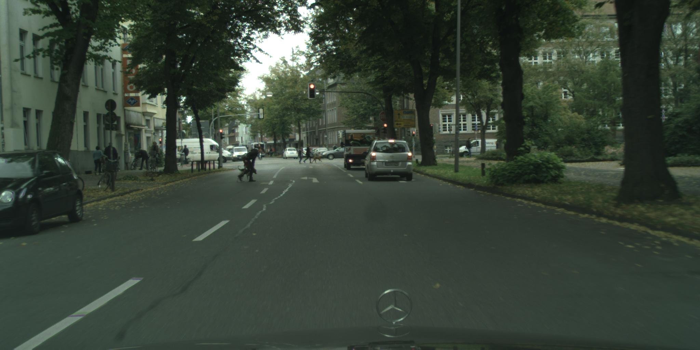
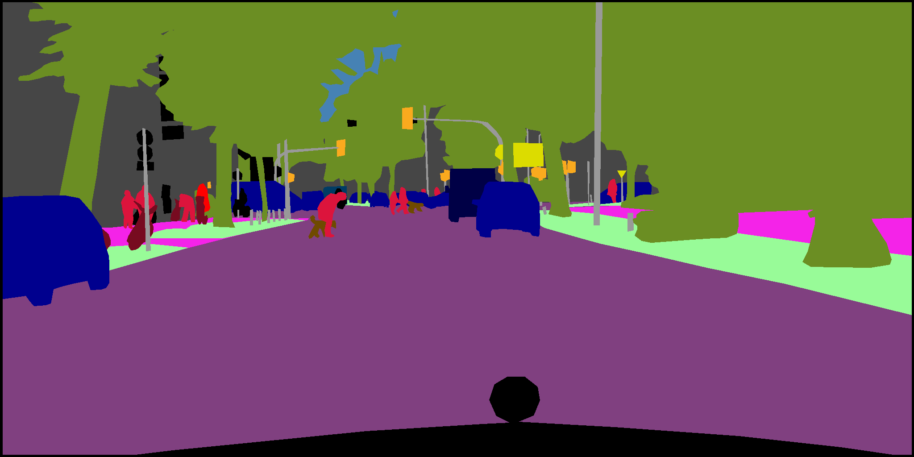
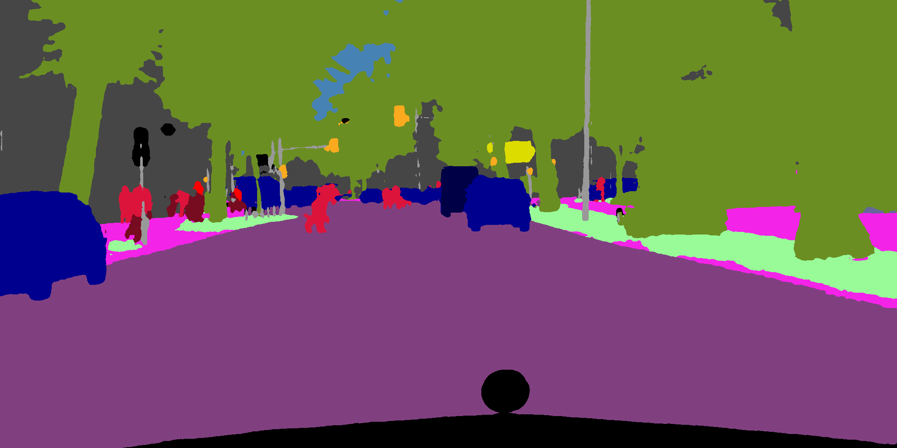
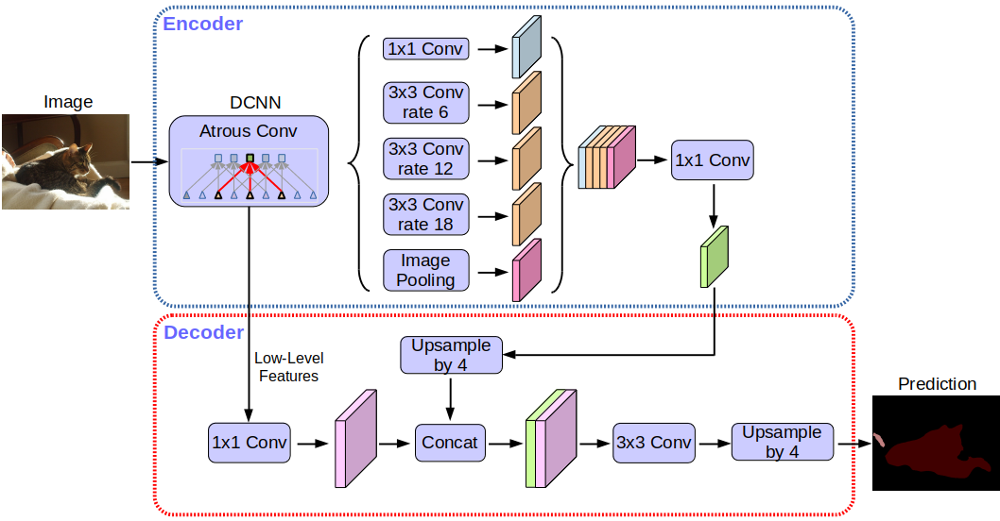

# Semantic Segmentation Cityscapes

This repository contains the implementation of a multi-class semantic segmentation pipeline for the popular Cityscapes [1] dataset, using PyTorch and the Segmentation Models Pytorch (SMP) [2] library. Models trained with this codebase generate predictions that can directly be submitted to the official [Benchmark Suite](https://www.cityscapes-dataset.com/benchmarks/).

|Image|Ground truth|Prediction|
|:-:|:-:|:-:|
||||

The code was developed by **Corentin Henry** and **Massimiliano Viola** for the **Image and Video Understanding** course held at TU Graz during the winter semester of 2022.

## Dependencies

A working installation of Python 3.7 or later is required. All the necessary libraries to run the scripts can then be installed with `pip install -r requirements.txt`. We recommend creating a virtual environment using a tool like [Miniconda](https://docs.conda.io/en/latest/miniconda.html).

## Dataset

The Cityscapes Dataset focuses on semantic understanding of urban street scenes, with high-quality pixel-level annotations of 5000 frames for numerous cities and classes. The dataset is freely available to academic and non-academic entities for non-commercial purposes such as academic research, teaching, scientific publications, or personal experimentation. More details and download are available at [www.cityscapes-dataset.com](https://www.cityscapes-dataset.com/).

## Train models

SMP easily allows us to train famous semantic segmentation architectures such as U-Net [3], DeepLabv3+ [4], and many others.

|U-Net|DeepLabV3+|
|:-:|:-:|
|||

In order to do so:
1. Edit `CUDA_VISIBLE_DEVICES` environment variable in `run.sh` to the GPU device IDs to use.
2. Modify training constants in `launch.py` to configure an experiment. In particular, choose between different encoders, weight initializations, architectures, augmentations and loss functions. See all available options in the [SMP documentation](https://smp.readthedocs.io/en/latest/). Set the max number of epochs and the crop patch size, updating the batch size and workers accordingly to your system.
3. Start from the terminal with `./run.sh` to train a model, save it, and run inference on the test images.

**Hardware Note:** all code has been tested and is set to run on a GPU with at least 16GB of VRAM, such as an NVIDIA® Tesla® P100 available for free on [Kaggle](https://www.kaggle.com/). Multi-GPU training was tested on two NVIDIA T4 GPUs available on Kaggle too. Modify the batch size or the patch size when using different hardware to fully take advantage of the graphic cards.

## Visualize models

By concatenating subsequent images of the test set with predictions overlayed, a time-lapse for a city can be generated. In order to do so:
1. In `visualization.py`, set the path to a model checkpoint, making sure to select the proper encoder and weight initialization.
2. Select a city, the number of images to predict, and the frame rate.
3. Run with `python3 ./visualization.py` to get the output video.

|DeepLabV3+ with EfficientNetB4 [5] backbone|
|:-:|
||

## References

[1] Cordts et al., "The Cityscapes Dataset for Semantic Urban Scene Understanding", https://www.cityscapes-dataset.com  
[2] Pavel Iakubovskii, "Segmentation Models Pytorch", https://github.com/qubvel/segmentation_models.pytorch  
[3] Ronneberger et al., "U-Net: Convolutional Networks for Biomedical Image Segmentation", https://arxiv.org/pdf/1505.04597.pdf  
[4] Chen et al. "Encoder-Decoder with Atrous Separable Convolution for Semantic Image Segmentation", https://arxiv.org/pdf/1802.02611.pdf  
[5] Tan, Le, "EfficientNet: Rethinking Model Scaling for Convolutional Neural Networks", https://arxiv.org/pdf/1905.11946.pdf  
